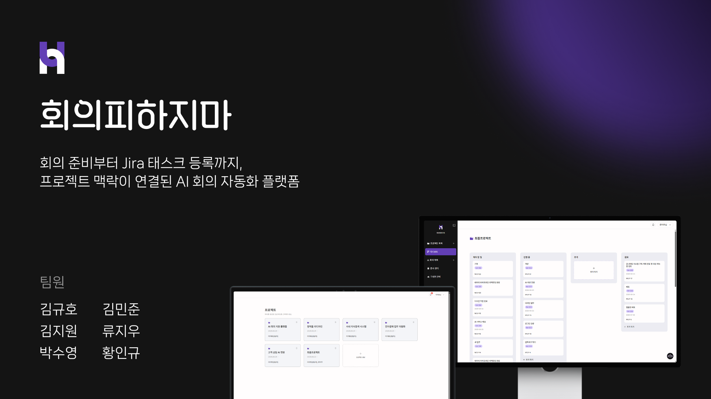

```mermaid
flowchart LR
    A["회의 생성"] --> B["AI 기초 안건 생성"]
    B --> C["회의 준비 자료 생성"]
    C --> D["회의 시작 및 진행<br/>RAG 챗봇 동시 사용 가능"]
    D --> E["회의 종료"]
    E --> F["STT 변환 및 화자 분리<br/>자동 수행"]
    F --> G["발화자 매핑<br/>SPEAKER_00 → 참여자 실명 수동 연결"]
    G --> H["회의록 생성 및 태스크 자동 추출<br/>회의록 생성 API에서 동시에 처리"]
    H --> I["회의록 승인<br/>is_meeting_approve = True 처리"]
    I --> J["요약 이메일 발송<br/>AWS SES 기반 회의록·태스크 발송"]
    J --> K["Jira 태스크 등록<br/>확정된 태스크를<br/>Jira 이슈로 생성"]
    K --> L["칸반 대시보드<br/>Jira 이슈 상태 기반 태스크 관리"]
```

# SKN24-FINAL-1TEAM

<p align="center">
  
</p>

# 회의피하지마 HPM

> AI 기반 통합 회의 관리 플랫폼  
> 회의 준비부터 회의 진행, 회의록 생성, 태스크 추출, Jira 연동까지 하나의 흐름으로 연결하는 **회의 자동화 협업 서비스**

---

## 팀원

| 이름 | github |
| --- | --- |
| 김규호 | https://github.com/kyu5KIm |
| 김지원 | https://github.com/edu-ai-jiwon |
| 김민준 | https://github.com/miin-jun |
| 류지우 | https://github.com/jia11234 |
| 박수영 | https://github.com/suyoung6279 |
| 황인규 | https://github.com/hwang-in-kyu |

---

## 목차

1. [개요](#개요)
2. [목적](#목적)
3. [주요 고객](#주요-고객)
4. [주요 기능](#주요-기능)
5. [경쟁사 분석 및 차별화](#경쟁사-분석-및-차별화)
6. [시스템 아키텍처](#시스템-아키텍처)
7. [ERD](#erd)
8. [활용 데이터](#활용-데이터)
9. [모델 선정](#모델-선정)
10. [모델 테스트 및 평가](#모델-테스트-및-평가)
11. [서비스 구성](#서비스-구성)
12. [기술 스택](#기술-스택)
13. [비즈니스 모델(BM)](#비즈니스-모델bm)
14. [기대 효과](#기대-효과)
15. [향후 발전 방향](#향후-발전-방향)

---

## 개요

### 배경 및 시장 현황


한국 기업의 업무 환경은 단계적으로 디지털화되어 왔다. 협업 툴은 초기에는 IT 기업이나 스타트업 중심으로 활용되었으나, 현재는 조직 규모와 업종을 가리지 않고 폭넓게 도입되는 추세이다.

최근에는 금융권에서도 STT와 LLM을 결합한 AI 회의록 시스템을 도입하고 있으며, 회의 내용을 자동으로 텍스트화하고 핵심 내용과 주요 의사결정 사항을 요약하는 방식으로 업무 효율화를 시도하고 있다.

2020년 이후 국내 협업 SW 시장은 연평균 두 자릿수 성장률을 기록하고 있으며, 전 세계 협업 애플리케이션 시장 역시 지속적으로 성장할 것으로 전망된다. 특히 글로벌 AI 회의 어시스턴트 시장은 원격·하이브리드 근무 환경과 협업 플랫폼 연동 수요 증가로 빠르게 확대되고 있다.

<br>

### 문제 정의

회의의 비효율은 회의가 진행되는 순간에만 발생하지 않는다. 실제로는 회의 전 준비 단계에서 목적과 안건이 명확히 정리되지 않거나, 회의 후 결과가 업무로 자연스럽게 이어지지 않는 구조에서 시작된다.

기존 AI 회의 도구는 음성 전사, 회의 요약, 액션 아이템 추출 등 회의 중·후 단계의 일부 기능에 집중하는 경우가 많다. 회의 준비 자료 생성, 내부 문서 검색, 태스크 관리, Jira 연동이 필요할 경우에는 별도의 협업 도구나 프로젝트 관리 도구를 병행해야 한다.

이처럼 협업 도구, 프로젝트 관리 시스템, 메신저, AI 도구가 분산되면 사용자는 여러 애플리케이션을 반복적으로 오가야 한다. 이 과정에서 툴 피로가 발생하고, 회의에서 나온 결과가 실무에 반영되기까지 추가 시간이 소요된다.

<br>

### 서비스 필요성

회의피하지마는 회의 준비의 공백과 툴 파편화 문제를 해결하기 위해 기획된 통합 회의 관리 플랫폼이다.

회의 전에는 회의 주제, 외부 요청 자료, 내부 문서, 이전 회의록을 바탕으로 AI가 기초 안건과 회의 준비 자료를 생성한다. 회의 중에는 RAG 기반 챗봇을 통해 필요한 정보를 검색하고, 회의 후에는 STT와 화자 분리 기술을 활용해 회의록과 태스크를 자동 생성한다.

생성된 태스크는 칸반 대시보드와 Jira에 연동되어 회의 결과가 실제 업무로 이어지도록 한다. 즉, 회의피하지마는 회의의 전 과정을 하나의 플랫폼 안에서 연결하여 회의 준비, 진행, 정리, 업무 배정의 단절을 줄이고자 한다.

---

## 목적

회의피하지마의 목적은 회의 준비의 공백과 회의 후속 업무의 단절로 인해 발생하는 비효율을 해결하는 것이다.

회의 전 자료 수집부터 회의 후 결과 도출까지의 모든 과정을 하나의 플랫폼에 담아내고, 회의를 기반으로 생성된 태스크를 Jira에 연동하여 기존의 툴 파편화 문제를 완화한다.

이를 통해 회의의 결과물이 단순히 회의록 문서로 끝나는 것이 아니라, 담당자·기한·우선순위가 포함된 실무 태스크로 전환되어 바로 실행될 수 있는 협업 환경을 제공하고자 한다.

회의피하지마는 다음과 같은 사용자 경험을 제공한다.

- 회의 주제와 자료를 기반으로 **기초 안건과 회의 준비 자료를 자동 생성한다.**
- 회의 중 필요한 정보를 RAG 기반 챗봇으로 검색하여 **회의 맥락 유지와 의사결정을 지원한다.**
- 회의 녹음 파일을 STT로 변환하고 화자를 구분하여 **회의록과 원문 텍스트를 함께 보관한다.**
- 회의 내용에서 태스크를 추출하고 담당자와 기한을 매핑하여 **후속 업무 정리를 자동화한다.**
- 칸반 대시보드와 Jira 연동을 통해 **회의 결과가 실무 프로세스로 이어지도록 한다.**

<br>

### 주요 고객

회의피하지마의 주요 고객은 Jira 기반 업무 환경에서 회의 전후의 단절로 비효율을 겪는 조직과 실무자이다.

특히 회의 빈도가 높고, 회의 결과를 프로젝트 관리 도구에 다시 정리해야 하는 개발팀, 기획팀, 마케팅팀, HR팀과 같은 협업 중심 조직을 주요 대상으로 한다.

회의피하지마는 회의 준비, 회의록 작성, 업무 배정, 태스크 추적을 하나의 흐름으로 연결하여 회의가 잦은 조직의 반복 업무를 줄이고, 회의 결과를 실행 가능한 업무 단위로 전환하는 데 초점을 둔다.

---

## 주요 기능

| 기능 | 설명 |
| --- | --- |
| **회의 생성** | 회의 주제, 장소, 일정, 참여자를 입력하여 회의를 생성하고 외부 요청 자료를 업로드한다. |
| **OCR 기반 자료 처리** | 스캔 문서나 이미지 자료를 텍스트로 변환하여 AI 기초 안건 및 준비 자료 생성에 활용한다. |
| **AI 기초 안건 생성** | 회의 주제, 간략 설명, 외부 요청 자료를 바탕으로 회의 전 검토할 기초 안건을 자동 생성한다. |
| **회의 전 안내 메일** | 확정된 참석자에게 회의 목적, 장소, 일정, 기초 안건이 포함된 안내 메일을 발송한다. |
| **회의 준비 자료 생성** | 사내 문서, 외부 자료, 이전 회의록, 프로젝트 자료를 AI가 탐색하여 회의 준비 자료를 생성한다. |
| **회의 중 RAG 챗봇** | 내·외부 데이터와 이전 회의록을 기반으로 회의 중 필요한 정보를 질의응답 형태로 제공한다. |
| **STT 및 화자 분리** | 회의 녹음 파일을 텍스트로 변환하고 발화자를 구분하여 회의록 생성의 기반 데이터로 활용한다. |
| **회의록 자동 생성** | 회의 원문을 기반으로 핵심 논의 내용, 결정 사항, 업무 내용을 포함한 회의록을 생성한다. |
| **태스크 자동 추출** | 회의 내용에서 태스크명, 담당자, 기한, 우선순위를 추출하고 사용자가 검토 후 확정할 수 있다. |
| **칸반 대시보드** | 프로젝트 단위로 담당자별 태스크 진행 현황을 모니터링한다. |
| **Jira 연동** | 확정된 태스크를 Jira 이슈로 생성하고, 칸반과 Jira 간 상태·담당자·기한·우선순위를 동기화한다. |

<br>

### 서비스 흐름

:::writing{variant="standard" id="84927"}
### 서비스 흐름



---

## 경쟁사 분석 및 차별화

### 경쟁사 비교

| 기능 | ClovaNote | Notion AI | MS Teams | Daglo | **회의피하지마** |
| --- | :---: | :---: | :---: | :---: | :---: |
| 회의 준비 내용 생성 | ❌ | ✅ | ❌ | ✅ | ✅ |
| 음성 → 자동 요약 | ✅ | ✅ | ✅ | ✅ | ✅ |
| 화자 분리 | ✅ | ❌ | ✅ | ✅ | ✅ |
| 태스크 자동 분류 | ❌ | △ | ✅ | △ | ✅ |
| 태스크 담당자 추론 | ❌ | △ | △ | △ | ✅ |
| Jira 연동 | ❌ | 수동 | 수동 | ❌ | **자동 / 양방향** |

<br>

### 차별화 포인트

ClovaNote는 음성 자동 요약과 화자 분리에 강점이 있지만, 회의 준비 내용 생성과 Jira 연동은 지원하지 않는다. Notion AI는 문서 기반 정리와 자료 수집에 활용할 수 있으나, 회의 음성 기반 화자 분리와 자동 Jira 연동에는 한계가 있다. MS Teams는 회의 요약과 일부 태스크 추출 기능을 제공하지만, 회의 준비 자료 생성과 Jira 자동 연동 측면에서는 제한적이다. Daglo는 음성 기록과 요약에 강점이 있으나, 태스크 담당자 자동 분류와 Jira 연동까지 이어지는 구조는 부족하다.

회의피하지마는 회의 전 준비 자료 생성, 회의 중 정보 검색, 회의 후 회의록 생성과 태스크 추출, 칸반 대시보드 및 Jira 연동까지 하나의 흐름으로 처리한다. 기존 서비스가 특정 단계의 자동화에 집중한다면, 회의피하지마는 회의 준비부터 업무 배정까지 전 과정을 자동화하는 통합 업무 자동화 서비스라는 점에서 차별화된다.

---

## 시스템 아키텍처


회의피하지마는 React 기반 프론트엔드, Django REST Framework 기반 백엔드, FastAPI 기반 AI 서버, MySQL 데이터베이스, Qdrant 벡터 데이터베이스, Jira API 연동 구조로 구성된다.

주요 AI 기능은 OCR, STT, 문서 파싱·임베딩, LLM/RAG 서버로 분리하여 관리한다. 백엔드는 회의·프로젝트·사용자·문서·태스크 데이터를 관리하고, AI 서버와 통신하여 안건 생성, 준비 자료 생성, 회의록 생성, 태스크 추출 결과를 저장한다.

---

## ERD


주요 데이터 구조는 사용자, 프로젝트, 프로젝트 구성원, 회의, 회의 참여자, 내부 문서, 회의 준비 자료, 기초 안건, 녹음 원본, 회의록, 회의 태스크, 챗봇 내역, 알림을 중심으로 구성된다.

---

## 활용 데이터

| 데이터 | 활용 방식 |
| --- | --- |
| 회의 기본 정보 | 회의 주제, 장소, 일정, 참여자를 기반으로 회의 생성 및 안내 메일 발송에 활용 |
| 외부 요청 자료 | JPG, JPEG, PNG, PDF 형태의 자료를 OCR 처리하여 기초 안건과 준비 자료 생성에 활용 |
| 내부 문서 | 프로젝트별 문서를 RAG 검색 대상으로 사용하여 준비 자료와 챗봇 답변의 근거로 활용 |
| 이전 회의록 | 과거 회의 맥락을 검색하여 회의 준비 자료 생성 및 회의 중 챗봇 답변에 활용 |
| 회의 녹음 파일 | STT 변환, 화자 분리, 회의록 생성, 태스크 추출의 입력 데이터로 활용 |
| 태스크 데이터 | 회의 후 도출된 업무를 칸반 대시보드와 Jira 이슈로 연동 |
| 챗봇 질의·답변 내역 | 회의 중 사용자의 질문과 답변을 저장하여 회의 종료 후 조회 가능하도록 활용 |

---

## 모델 선정

| 영역 | 선정 방향 | 활용 목적 |
| --- | --- | --- |
| OCR | 문서·이미지 텍스트 추출 모델 | 외부 요청 자료와 스캔 문서의 텍스트 변환 |
| STT | WhisperX 기반 음성 인식 | 회의 녹음 파일을 텍스트로 변환 |
| 화자 분리 | Diarization 기반 화자 구분 | 발화자별 대화 분리 및 담당자 추론 보조 |
| Embedding | 한국어 문서 검색에 적합한 임베딩 모델 | 내부 문서, 이전 회의록, 프로젝트 자료 검색 |
| Vector DB | Qdrant | RAG 검색을 위한 문서 벡터 저장소 |
| LLM | vLLM 기반 회의 요약·생성 모델 | 기초 안건 생성, 준비 자료 생성, 회의록 생성, 태스크 추출 |

모델은 단순히 성능만 기준으로 선정하지 않고, 한국어 회의 데이터 처리 품질, 처리 속도, 비용, 배포 가능성, 회의록·태스크 생성 결과의 안정성을 함께 고려한다.

---

## 모델 테스트 및 평가

| 평가 영역 | 평가 기준 |
| --- | --- |
| STT 성능 | WER, CER, 한국어 인식률, 전문용어 인식률, 처리 시간 |
| 화자 분리 | 발화자 구분 정확도, 오버랩 발화 처리, 참석자 매핑 가능성 |
| 회의록 생성 | 핵심 논의 내용 반영 여부, 결정 사항 누락 여부, 요약의 일관성 |
| 태스크 추출 | 담당자, 기한, 우선순위 추출 정확도 및 수정 가능성 |
| RAG 검색 | 관련 문서 검색 정확도, 출처 표시 여부, 정보 없음 처리 |
| Jira 연동 | 이슈 생성 성공 여부, 칸반 상태 변경 동기화 여부 |

---

## 서비스 구성

```text
SKN24-FINAL-1Team/
├─ frontend/          React + TypeScript + Vite
├─ backend/           Django REST Framework API
├─ ai/
│  ├─ ocr/            OCR server
│  ├─ stt/            WhisperX STT server
│  ├─ parsed/         Document parsing + embedding + Qdrant ingest
│  └─ vllm/           LLM/RAG server
├─ docker-compose.yml
├─ Dockerfile.backend
├─ Dockerfile.frontend
└─ nginx.conf
```

<br>

### 상세 문서

| 문서 | 내용 |
| --- | --- |
| [frontend/README.md](frontend/README.md) | 프론트엔드 실행, 라우트, API 호출 구조 |
| [backend/README.md](backend/README.md) | Django API, 환경변수, AI 서버 연동 |
| [ai/README.md](ai/README.md) | AI 서비스 전체 구조 |
| [ai/ocr/README.md](ai/ocr/README.md) | OCR 서버 |
| [ai/stt/README.md](ai/stt/README.md) | STT 서버 |
| [ai/parsed/README.md](ai/parsed/README.md) | 문서 ingest 서버 |
| [ai/vllm/README.md](ai/vllm/README.md) | LLM/RAG 서버 |

---

## 기술 스택

| 영역 | 사용 기술 |
| --- | --- |
| Frontend | React, TypeScript, Vite, Zustand, Axios, Tailwind CSS |
| Backend | Django, Django REST Framework, Simple JWT, MySQL |
| AI | FastAPI, WhisperX, PaddleOCR-VL, vLLM, Qdrant, SentenceTransformers |
| Infra | Docker, nginx, RunPod, AWS S3/SES, Jira API |
| Collaboration | GitHub, Jira, Postman, VSCode |

---

## 비즈니스 모델(BM)

회의피하지마는 Jira 기반으로 업무를 관리하는 조직과 실무자를 주요 대상으로 하는 B2B SaaS 형태로 확장할 수 있다.

기본 회의 생성, 회의록 조회, 제한적 STT 기능은 기본 기능으로 제공하고, 장시간 회의 요약, 대용량 내부 문서 RAG, 팀 단위 통계, Jira 양방향 자동 동기화, 조직 단위 관리자 기능 등은 유료 플랜으로 분리할 수 있다.

---

## 기대 효과

- 회의 전 안건과 준비 자료를 자동 생성하여 **회의 준비 시간을 줄인다.**
- 회의 중 필요한 정보를 즉시 검색할 수 있어 **회의 흐름과 의사결정 속도를 개선한다.**
- 회의 후 회의록과 태스크를 자동 생성하여 **수작업 정리 부담을 줄인다.**
- 담당자, 기한, 우선순위가 포함된 태스크를 Jira와 연동하여 **회의 결과의 실행력을 높인다.**
- 여러 협업 도구를 오가는 과정을 줄여 **툴 피로와 컨텍스트 전환 비용을 완화한다.**

---

## 향후 발전 방향

- 회의 준비 자료 생성 시 내부 문서, 외부 자료, 이전 회의록의 출처 표시 정확도 개선
- STT 화자 분리 및 참석자 자동 매핑 정확도 고도화
- 회의록 생성 결과에 대한 사용자 검토·승인 플로우 개선
- Jira 양방향 동기화 안정화 및 상태 충돌 처리 로직 보완
- 프로젝트별 회의 이력, 태스크 처리율, 담당자별 업무 현황을 시각화하는 대시보드 확장
- 조직별 회의 패턴 분석을 통한 회의 효율성 리포트 제공

---
